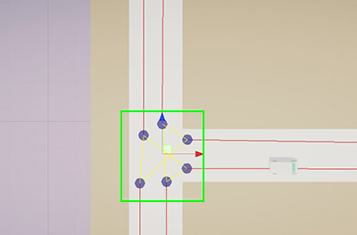

# Undergraduate Thesis Draft  
**Advantages of Communication between Autonomous and Semi-Autonomous Vehicles**  
**Hutton Amison-Addy**  
**87152025**  
**Ashesi University**  
**April 7, 2024**  

---

## Abstract  

The urge for shorter travel times has led people to find better, real-time routes to minimize travel time [4], which has also become another motivator for the implementation of autonomous vehicles for their efficiency. Gathering and exchanging data could enable vehicles to expand their environmental awareness for improved journey-related decisions.

**How does communication among autonomous vehicles impact travel time and safety?** This study aims to investigate inter-vehicle communication's effects on journey time and overall traffic flow. This study uses a simulation of vehicles with and without the ability to exchange information while navigating road network environments based on real-world locations. The journey time of the vehicles is recorded and analyzed for assessment.

Findings and conclusions will be discussed in the completed report.

---

## Abbreviations  

- **AV** - Autonomous Vehicles  
- **CAV** - Communicative Autonomous Vehicles  
- **V2V** - Vehicle to Vehicle  
- **V2I** - Vehicle to Infrastructure  
- **V2N** - Vehicle to Network  
- **V2X** - Vehicle to Everything  
- **V2P** - Vehicle to Pedestrian  

---

## Chapter 1: Introduction  

Implementing autonomous vehicles on roads has promised more efficient travel and improvement. Research and implementation, such as Waymo's self-driving program, are ongoing. However, these implementations share a common attribute: autonomous vehicles operate independently of each other, integrating no form of communication to share their perception of their environment with other vehicles. This study is interested in how inter-vehicle communication among autonomous vehicles (and human-driven vehicles) enhances real-time decision-making, reduces travel time, and improves traffic flow.

### Background  

Increasing road vehicles has led to increased traffic congestion and road accidents. The increase in road accidents has been attributed to natural factors and human driver errors [8], highlighting the need for self-driving vehicles. The urge for shorter travel times has led people to find better, real-time routes to minimize travel time [4], which has also become another motivator for the implementation of autonomous vehicles for their efficiency.

Implementing artificial intelligence in vehicles has been explored with earlier stages involving navigation planners like those used in Google Maps, which has been used to route the most optimal path to a destination based on routes other vehicles take, improving journey time.

Research and simulation experiments are performed to develop autonomous systems that can complement or replace human drivers on the road. An example of autonomous vehicles implemented on roads is Google's Waymo fleet, equipped for route planning, autonomous navigation, object collision detection, and adherence to road regulations.

Implementing communication between autonomous vehicles could enhance safety and improve journey time by expanding other vehicles' environmental awareness. Several Connected Automated Vehicle (CAV) applications have recently been designed to improve the performance of transportation systems. Some of these applications include the implementation of cooperative collision avoidance systems where vehicles share their positions and speed to avoid rear collisions [6].

Safety, mobility, and environmental sustainability are three cornerstone performance metrics for evaluating CAV applications' benefits [16].

However, current implementations of autonomous vehicles lack communication with other vehicles, preventing them from expanding their environmental awareness beyond their sensors. Proposals have been made about how autonomous vehicles could interact with each other, such as the concept of Distributed and Safe Autonomous Navigation for a Swarm of Autonomous Vehicles [12].

### Research Question  

With the rise of autonomous and varying forms of AI-assisted driving, how does communication between autonomous vehicles improve travel time and safety?

### Aim  

The research aims to investigate the advantages autonomous and semi-autonomous vehicles capable of communicating with each other have over autonomous vehicles not capable of communicating with each other in areas such as journey length. The primary factors to be observed are how vehicles avoid collisions and reduce the impact, coordinate on highways and intersects, and how long it takes to move from start to destination.

### Objectives  

- Design a communication and decision-making framework based on existing research.  
- Simulate the framework in environments mirroring real road networks.  
- Measure performance using journey time, safety incidents, and traffic density.  

### Significance  

Enabling vehicles to share environmental data can enhance safety through improved road awareness and potentially reduce environmental impact by shortening journey times. At the end of the research, the study will provide insight into how these vehicles perform in terms of journey time, traffic flow, and safety factors such as collision avoidance. The research also has the potential to advise future implementation of Communicating Autonomous Vehicles.

---

## Chapter 2: Literature Review  

With the rise of autonomous and varying forms of AI-assisted driving, how does communication between autonomous vehicles improve travel time and safety? This literature review aims to analyze related works and provide an overview of knowledge and current research relating to Connected Autonomous Vehicles.

### Autonomous Vehicles  

Autonomous vehicles and AI-assisted vehicles have been a field heavily researched and implemented. Their research focused on path planning, decision-making, and safety. Research has been focused on elements like collision and obstacle avoidance and efficient path planning with the implementation of concepts like the Markov chain into decision-making for these vehicles [2]. Connecting autonomous vehicles expands their environmental awareness through shared information.

### Environment Perception in AV  

A crucial prerequisite for optimal decision-making is accurate situational awareness of automated and connected vehicles [9]. Being able to perceive their environment enables AVs to determine optimal decisions. A map is a crucial piece of information about an environment for AVs. Still, they would need to be able to determine their position on the map to use it for navigation planning especially. A GPS-aided auto navigation system with AV position and heading control is proposed [15].

Another form of perception studies on AV agrees that vision is a crucial form of perception. With suitable algorithms and models, such as the Canny man algorithm, much information can be gained from visual data schemas, object and edge detection, and distance [3]. Sensors such as cameras, lidars, and sonar can help provide AVs with visual perception of the environment.

### Decision-making on the Road  

The average driver makes 200 decisions per minute behind the wheel. From when to make an overtake to the ideal route. These decisions are based on information about their internal and external environment to make the most optimal choices to get to a destination [5].

With decision-making in autonomous vehicles, the vehicles need to build, monitor, and synthesize an internal representation of the environment around them and then use it. This representation is used to formulate decisions and interact appropriately to ensure safety, avoid collisions with vehicles and pedestrians, and obey traffic rules [7].

Decision-making in modern AVs focuses on Route Planning with algorithms like the A* algorithm providing optimal paths while also focusing on Collision avoidance and Velocity control. Ghraizi describes an architecture for decision-making involving collision avoidance, route planning, rule observation, and immediate motion planning.

### Communication Between Vehicles  

A collective of autonomous cars is like a swarm of AVs, like a group of termites and animals; despite their size and the ability of the individuals, they can complete the most complex formations and achieve the most significant result [3].

Their ability to share information amongst themselves extends their environmental awareness, allowing them to plan optimal routes based on traffic density or reroute when an accident occurs on a road on their path or to make safer entries in junctions and intersections.

**Vehicle-to-Everything (V2X)** is a communication technology paradigm that allows real-time information sharing between the AV and other road users in the surrounding vicinity [1]. This includes:

- **V2V**: Vehicle to Vehicle  
- **V2I**: Vehicle to Infrastructure  
- **V2N**: Vehicle to Network  
- **V2P**: Vehicle to Pedestrian  

V2I allows vehicles to share information with other vehicles through existing smart infrastructures [10]. V2N allows communication between vehicles and cloud services [14]. V2P involves sharing information with non-autonomous components, including pedestrians, bikes, and human drivers.

### Enhancements to Decision-making from Communication  

With vehicles having the means to share information, their environmental awareness becomes more extensive, which may positively impact their decisions. The ability to determine traffic density or inaccessible and closed roads on a given route can be used to make more optimal routes [19].

Vehicles able to communicate can also determine right-of-way policies in junctions and intersections, improving safety at such critical points [17].

### Existing Studies and Simulations  

- **Kim et al.** (Cooperative Perception for Autonomous Vehicle Control on the Road) tested if a manually driven vehicle could send data to an autonomous vehicle to help it plan better routes. Results showed improved route planning [11].  
- **Evaluating the impact of connected and autonomous vehicles on traffic safety** involved simulations with human drivers, AVs, and CAVs. Results: improved traffic flow with higher CAV presence. The authors suggest studying V2I/V2N effects in complex networks [18].

### Conclusion  

CAVs are poised to reshape transportation and mobility, improving safety, capacity, energy efficiency, and emissions [17]. V2X communications allow CAVs to exchange real-time information and 'see' beyond their line of sight [11], enhancing driving safety [13].

---

## Chapter 3: Methodology  

The rise in traffic congestion and road accidents has been a primary motivator for developing autonomous vehicles and communication amongst connected autonomous vehicles. This study investigates the impact of communication among connected autonomous vehicles (CAVs) on traffic flow and travel time. It is focused on improvements to navigation and route planning.

A **simulation-based approach** allows controlled experimentation under different traffic conditions and customizable vehicle behaviors. The data collected will be **quantitative**, with metrics such as delay time being tracked.

The simulation environment builds upon the **Unity Traffic System** by Matthieu Cherubini [20], which provided:

- Road network creation tools  
- Basic vehicle object  

**Custom modules** were developed to incorporate:

- Decentralized communication  
- Dynamic routing  
- Real-time performance logging  

**The following sections (not yet included)** will describe:

- Simulation design and rationale  
- Experimentation setup  
- Road and vehicle parameters  
- Data collection and analysis methods

# Unity Traffic Simulation

Traffic Simulation is a Unity asset that lets you easily simulate simple traffic into your scene.

Developed / Tested with Unity 2018.3.x and plus.

## How to use
### Note
1. If you have any problem with the traffic system, press the *Re-Structure Traffic System* button on the *Traffic System* GameObject to re-generate the traffic system.
2. Make sure to be in Top Orthographic view, in the editor, when you create your waypoint system.

### Create a Traffic System
1. Create a Traffic System via *Component -> Traffic Simulation -> Create Traffic Simulation*
2. Select the *Traffic System* object in the hierarchy
3. Press *Ctrl + Left Click* to place the first waypoint of the segment (create a new segment)
4. If you press *Shift + Left Click* it will continue the segment, otherwise step 3. to create a new segment. Usually a segment stops at an intersection. **Note that the vehicle will follow the waypoints depending on the order you placed them.**
5. The next step is a bit tedious at the moment. Basically you have to link the segments between each other - so when the the segment ends at an intersection, you can go to a certain number of segments which will be picked up randomly by the VehicleAI. To do so, select a segment and plug your next segments in the *Next Segments* parameter.
6. To create an intersection, press *Alt + Left Click* and select the intersection type (stops or traffic lights).
7. Set the dimension of the intersection's box collider so it covers all the last waypoints (cf: below image). Also make sure that the height of the box collider is high enough to collide with your vehicle.

#### Editing Segments / Intersections
If you delete existing segments or intersections, you will have to press the *Re-Structure Traffic System* button in order to rebuild the system.

#### Stops
1. Select *STOP* as the intersection type.
2. If you have any, select which lanes have the priority (without stop). This means if you leave it empty every lanes will include a stop and work on a first in first out basis.

#### Traffic Lights
1. Select *TRAFFIC_LIGHT* as intersection type.
2. Configure the two light groups by placing the segment on the group they belong to. Usually, two opposite lane share the same light group. In the example below, you would have to place the two segments ending with the blue round in one group and the two segments with the gray round on the other group.

3. Changing the light of your 3D model can be done via your own script. An example of this is provided in the example folder.

### Vehicle Configuration
1. Setup your vehicle as follow (you can also refer to the vehicle in the example scene):

       -> Main object with Rigidbody + BoxCollider
          -> Object with vehicle's body mesh (without the wheels!)
          -> Empty object for the 4 wheels
             -> Object with WheelCollider (but no mesh)
             -> Object with WheelCollider (but no mesh)
             -> Object with WheelCollider (but no mesh)
             -> Object with WheelCollider (but no mesh)
2. Select the vehicle object main parent and click on *Component -> Traffic Simulation -> Setup Vehicle*. This will add the needed scripts, set the proper layers and tag as well as create a raycast anchor.
3. Place the raycast anchor in the front of the vehicle's hood.
4. Configure *WheelDrive* and *VehicleAI* with your wanted paramters (torque, maximum speed, etc.). Set the left and right wheel mesh - they will be instantiate in runtime where your wheelcolliders are located.

---

MIT License

Copyright (c) 2019 Matthieu Cherubini

Permission is hereby granted, free of charge, to any person obtaining a copy of this software and associated documentation files (the "Software"), to deal in the Software without restriction, including without limitation the rights to use, copy, modify, merge, publish, distribute, sublicense, and/or sell copies of the Software, and to permit persons to whom the Software is furnished to do so, subject to the following conditions:

The above copyright notice and this permission notice shall be included in all copies or substantial portions of the Software.

THE SOFTWARE IS PROVIDED "AS IS", WITHOUT WARRANTY OF ANY KIND, EXPRESS OR IMPLIED, INCLUDING BUT NOT LIMITED TO THE WARRANTIES OF MERCHANTABILITY, FITNESS FOR A PARTICULAR PURPOSE AND NONINFRINGEMENT. IN NO EVENT SHALL THE AUTHORS OR COPYRIGHT HOLDERS BE LIABLE FOR ANY CLAIM, DAMAGES OR OTHER LIABILITY, WHETHER IN AN ACTION OF CONTRACT, TORT OR OTHERWISE, ARISING FROM, OUT OF OR IN CONNECTION WITH THE SOFTWARE OR THE USE OR OTHER DEALINGS IN THE SOFTWARE.